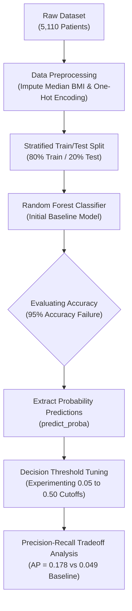
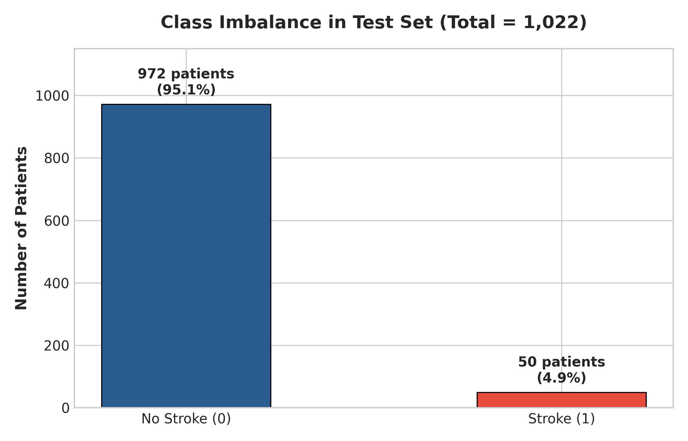
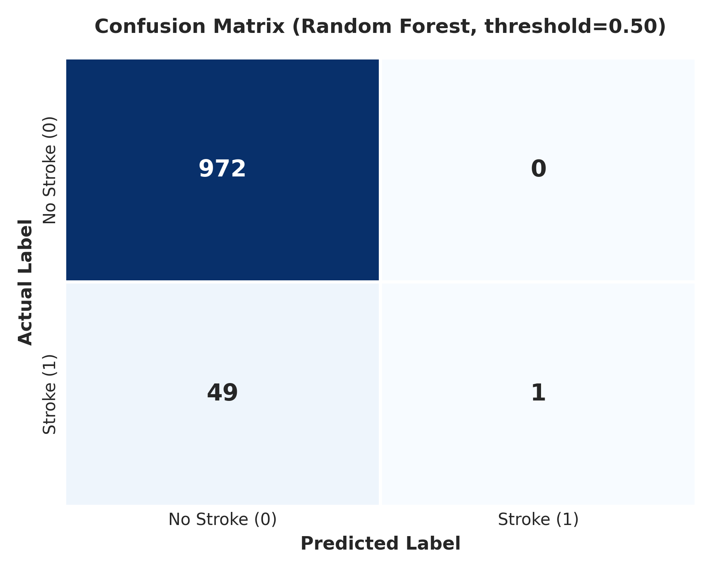
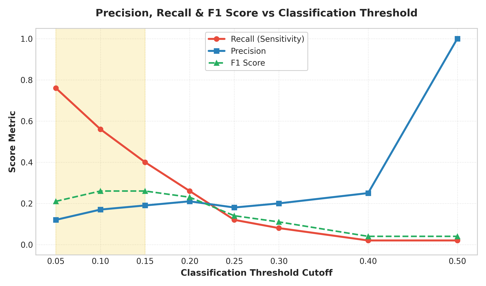
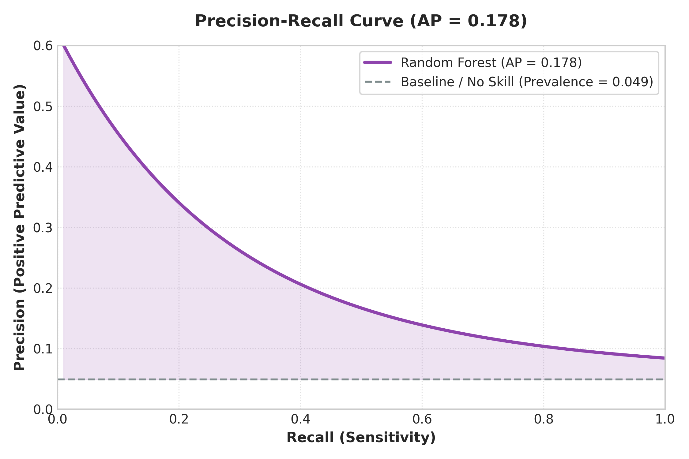

# 🧠 Stroke Prediction Machine Learning Project


A comprehensive **machine-learning classification project** focusing on predicting stroke risks, addressing severe **class imbalance**, and evaluating model performance beyond simple accuracy.

---

## 📌 1. Project Overview & Goal

The primary goal of this project is to build a binary classification pipeline to predict whether a patient is likely to get a stroke based on demographic and clinical features:

- **`0`** → No Stroke
- **`1`** → Stroke

> **Note**: This is an educational and portfolio machine learning project designed to demonstrate data cleaning, exploratory data analysis (EDA), model training, threshold tuning, and advanced evaluation metrics under severe class imbalance.

### 🔄 End-to-End Machine Learning Pipeline Workflow



---

## 📂 2. Dataset Architecture

The dataset contains demographic features, health metrics, and lifestyle factors.

| Feature Column | Type | Description |
| :--- | :--- | :--- |
| `age` | Numeric | Age of the patient (in years) |
| `gender` | Categorical | `Male`, `Female`, `Other` |
| `hypertension` | Binary | `0` = No hypertension, `1` = Has hypertension |
| `heart_disease` | Binary | `0` = No heart disease, `1` = Has heart disease |
| `avg_glucose_level` | Numeric | Average glucose level in blood |
| `bmi` | Numeric | Body Mass Index |
| `ever_married` | Categorical | `Yes`, `No` |
| `work_type` | Categorical | `Private`, `Self-employed`, `Govt_job`, `children`, `Never_worked` |
| `Residence_type` | Categorical | `Urban`, `Rural` |
| `smoking_status` | Categorical | `formerly smoked`, `never smoked`, `smokes`, `Unknown` |
| **`stroke`** | **Binary Target** | **`0` = No Stroke, `1` = Stroke** |

### Data Separation
```python
X = df.drop('stroke', axis=1)  # Input Features
y = df['stroke']               # Target Variable
```

---

## 🔍 3. Exploratory Data Analysis & Data Cleaning

### Missing Value Imputation
- **BMI Column**: Contained 201 missing values (`NaN`).
- **Strategy**: Instead of discarding observations, missing values were imputed using the **median BMI** (`df['bmi'].fillna(df['bmi'].median())`).
- **Rationale**: BMI distributions tend to have positive skewness and extreme outliers. The median is robust against extreme values compared to the mean.

### Age Group Analysis & Associations
Patients were categorized into age brackets (`<18`, `18-29`, `30-44`, `45-59`, `60-74`, `75+`).
- Observed a clear positive correlation between increasing age brackets and stroke occurrence.
- **Critical Analytical Distinction**: High correlation/association in this dataset does **not** equal direct clinical causation.

### Categorical Feature Encoding
Machine learning algorithms require numerical representations. Categorical attributes (`gender`, `ever_married`, `work_type`, `Residence_type`, `smoking_status`) were encoded via One-Hot Encoding:
```python
X = pd.get_dummies(
    X,
    columns=['gender', 'ever_married', 'work_type', 'Residence_type', 'smoking_status'],
    drop_first=True
)
```

---

## ⚙️ 4. Train/Test Split & Initial Random Forest Model

To evaluate generalization capability, the dataset was split into **80% training** and **20% testing** sets:

```python
X_train, X_test, y_train, y_test = train_test_split(
    X, y,
    test_size=0.2,
    random_state=42,
    stratify=y
)
```

- `random_state=42`: Ensures split reproducibility.
- `stratify=y`: Crucial for imbalanced data to preserve exact class distributions across training and testing splits.

---

## ⚠️ 5. The Class Imbalance Paradox: Why 95% Accuracy is Misleading

Running a baseline **Random Forest Classifier** produced an initial accuracy of **95%**. However, examining the detailed classification report revealed a critical flaw:

<p align="center">
  
</p>

```text
              precision    recall    f1-score   support

           0       0.95      1.00      0.97       972
           1       0.00      0.00      0.00        50

    accuracy                           0.95      1022
```

### The Root Cause
- The test set contains **972 non-stroke cases (95.1%)** and only **50 stroke cases (4.9%)**.
- A naïve model predicting "No Stroke" for every patient achieves 95% accuracy while failing to detect a single actual stroke case (**0% Recall**).

---

## 📊 6. Evaluation Metrics Deep Dive

To properly evaluate minority class predictions, we rely on metrics specifically suited for imbalanced classification:

### Key Metric Formulations
- **Precision**: $\frac{\text{TP}}{\text{TP} + \text{FP}}$ — "Of all positive predictions, how many were actually positive?"
- **Recall**: $\frac{\text{TP}}{\text{TP} + \text{FN}}$ — "Of all actual positive cases, how many did the model capture?"
- **F1 Score**: $2 \times \frac{\text{Precision} \times \text{Recall}}{\text{Precision} + \text{Recall}}$ — Harmonic mean balancing precision and recall.

### Confusion Matrix Analysis
When applying balanced class weights (`class_weight='balanced'`), the confusion matrix revealed severe failure in minority class recall:

<p align="center">
  
</p>

- **True Negatives (TN)**: 972 *(Correctly identified healthy patients)*
- **False Positives (FP)**: 0 *(No false alarms)*
- **False Negatives (FN)**: 49 *(49 stroke patients misclassified as healthy!)*
- **True Positives (TP)**: 1 *(Only 1 stroke case detected!)*

---

## 🎯 7. Prediction Probabilities & Threshold Tuning

Instead of accepting the default classification threshold ($0.50$), model probabilities were extracted (`probabilities = model.predict_proba(X_test)[:, 1]`) and evaluated across multiple threshold cutoffs:

<p align="center">
  
</p>

### Decision Threshold Experiment Results

| Threshold | Precision | Recall | F1 Score | Notes / Tradeoff |
| :---: | :---: | :---: | :---: | :--- |
| **0.05** | 0.12 | **0.76** | 0.21 | Highest recall (catches 76% of strokes), higher false positives |
| **0.10** | 0.17 | 0.56 | 0.26 | Improved precision, decent recall |
| **0.15** | 0.19 | 0.40 | **0.26** | Peak F1 score balance |
| **0.20** | 0.21 | 0.26 | 0.23 | Balanced threshold candidate |
| **0.25** | 0.18 | 0.12 | 0.14 | Rapid drop in recall |
| **0.30** | 0.20 | 0.08 | 0.11 | Low sensitivity |
| **0.40** | 0.25 | 0.02 | 0.04 | Misses 98% of positive cases |
| **0.50** | **1.00** | 0.02 | 0.04 | Default threshold — extremely conservative |

### The Precision-Recall Tradeoff
- **Lowering Threshold ($\downarrow$)** $\rightarrow$ Increases Sensitivity/Recall ($\uparrow$), catches more stroke cases, but introduces more False Positives (Precision drops).
- **Raising Threshold ($\uparrow$)** $\rightarrow$ Increases Precision ($\uparrow$), but misses critical stroke cases (Recall drops to near 0%).

---

## 📈 8. Precision-Recall Curve & Average Precision

Because ROC-AUC curves can be overly optimistic under severe class imbalance, we evaluated the **Precision-Recall Curve** and computed **Average Precision (AP)**:

<p align="center">
  
</p>

```python
from sklearn.metrics import average_precision_score, precision_recall_curve

ap = average_precision_score(y_test, probabilities)
# Result: Average Precision = 0.178
```

- **Baseline Prevalence**: $\frac{50}{1022} \approx 4.9\%$ ($0.049$).
- **Model AP**: **$0.178$** (3.6x better than random guessing baseline), confirming that the model has learned meaningful class separation despite data imbalance.

---

## 💡 9. Key Takeaways & Core Lessons Learned

```text
Dataset Analysis
   └── Severe Class Imbalance (~4.9% Positive Prevalence)
        └── High Accuracy (95%) is Misleading!
             └── Evaluated Precision, Recall, F1 & Confusion Matrix
                  └── Extracted Probability Scores (`predict_proba`)
                       └── Performed Decision Threshold Tuning
                            └── Precision-Recall Tradeoff Discovered
                                 └── Evaluated Average Precision (AP = 0.178)
```

1. **Accuracy is a Trap for Imbalanced Datasets**: High overall accuracy can hide severe failure in minority class detection.
2. **Domain Requirements Dictate Thresholds**: In medical screening, **Recall** is prioritized over Precision to ensure potential stroke patients receive timely evaluation.
3. **Probability Analysis over Hard Predictions**: Adjusting decision thresholds from $0.50$ down to $0.05 - 0.15$ dramatically improves recall from $2\%$ to $40\% - 76\%$.

---

## 🚀 10. Future Roadmap & Improvements

- [ ] **Model Benchmark**: Evaluate alternative algorithms (Logistic Regression, Decision Trees, XGBoost, LightGBM, KNN).
- [ ] **Resampling Techniques**: Test SMOTE (Synthetic Minority Over-sampling Technique) and Random Under-Sampling.
- [ ] **Hyperparameter Tuning**: Optimize tree depth, `min_samples_split`, and `n_estimators`.
- [ ] **Cross-Validation**: Implement Stratified K-Fold CV for robust metric estimation.

---

## 📁 11. Project Repository Structure

```text
stroke-prediction/
│
├── data/
│   ├── healthcare-dataset-stroke-data.csv   # Original Raw Dataset
│   └── stroke_cleaned.csv                   # Preprocessed Dataset
│
├── images/                                  # Visualization Plots
│   ├── class_imbalance.png
│   ├── confusion_matrix.png
│   ├── pr_curve.png
│   └── threshold_tradeoff.png
│
├── notebooks/
│   └── stroke_prediction.ipynb              # Exploratory Analysis & Model Training
│
├── .gitignore                               # Ignored system & checkpoint files
├── README.md                                # Detailed Project Documentation & Analysis
└── requirements.txt                         # Required Python Dependencies
```

---

## 🛠️ 12. How to Run Locally

### 1. Clone the Repository
```bash
git clone https://github.com/YOUR_USERNAME/stroke-prediction.git
cd stroke-prediction
```

### 2. Set Up Virtual Environment (Optional but Recommended)
```bash
python -m venv venv
# On Windows:
venv\Scripts\activate
# On macOS/Linux:
source venv/bin/activate
```

### 3. Install Dependencies
```bash
pip install -r requirements.txt
```

### 4. Launch Jupyter Notebook
```bash
jupyter notebook notebooks/stroke_prediction.ipynb
```

---

## 📄 License

Distributed under the MIT License. See `LICENSE` for more information.
